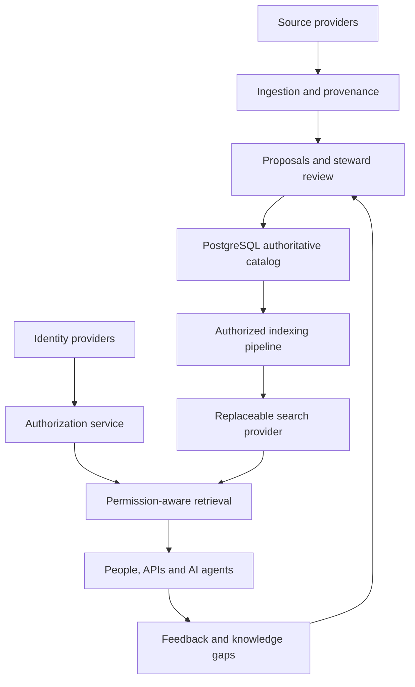

# KC-001 — Core architecture

Knowledge Catalog is a configurable, company-agnostic system of record for governed organizational knowledge. People, services, and AI agents consume the same permission-aware knowledge services. Organizations can deploy it as SaaS or self-host it; the initial database uses shared PostgreSQL tenancy.

## Boundaries

The catalog owns organizations, identities, configuration, knowledge versions, relationships, governance, evidence references, and audit history. Source content, search indexes, embeddings, and generated answers are separate concerns. Deleting a search index must not destroy authoritative knowledge.

Eight PostgreSQL namespaces separate responsibilities: `core`, `identity`, `catalog`, `source`, `governance`, `security`, `operations`, and `audit`. This monorepo contains `packages/kc`, `database`, `tests`, `docker`, and `docs`; future services and user interfaces can be added as `apps` without splitting the core into separate repositories or prematurely distributed services.

## Product invariants

1. OrganizationID is the tenant boundary. Every tenant relationship carries OrganizationID in its foreign key, including references made by privileged import/provisioning jobs.
2. Workspaces belong to one organization. Knowledge has one owning workspace and can be shared within that organization. Sharing describes organization; it does not itself grant access.
3. Knowledge objects are distinct from source artifacts. Published versions require evidence and preserve historical provenance.
4. Authority, approval, freshness, and relevance guide retrieval. Similarity alone does not establish trust.
5. Authorization happens before content reaches a model, including snippets, evidence, caches, traces, and search results.
6. AI can propose configuration and knowledge. Only an authorized human may approve and activate governed configuration. An `AI_AGENT` principal never gets the approval pool's database credentials.
7. Governance responsibilities do not grant security permissions. Being an Owner or SME is not equivalent to having source access or permission to approve configuration.
8. Provider interfaces isolate authentication, source connectors, object storage, search, embeddings, and generation. No Microsoft, Google, OpenAI, or other provider identifiers are catalog primary keys.
9. Configuration and published knowledge preserve history; deactivation does not destroy references. Legal purge is a separate authorized retention/hold workflow.
10. Important decisions and activation changes produce append-only audit evidence.

## Security and source ACLs

The planned effective-access rule is the intersection of tenant membership, workspace authorization, current source ACLs, catalog restrictions, and classification/AI handling policy. Catalog settings may narrow source access; they must never silently broaden it. Unknown, stale, or unavailable source permission information fails closed for retrieval until reconciled. Explicit denials prevail in the conservative baseline.

The KC-003 RLS foundation enforces tenant boundaries; it is not document-level authorization. A future source/retrieval implementation must demonstrate revocation propagation, permission trimming before generation, cache isolation, and negative leakage tests before enabling generative retrieval. This release has no retrieval endpoint, model integration, source connector, vector extension, or content corpus to expose.

External content, imported descriptions, model output, and evidence are untrusted data. They cannot supply executable SQL, authentication claims, permission grants, or workflow commands. Configuration package imports have a fixed schema and entity allowlist. Conditional and calculated-field expressions are stored as data; they are never evaluated as code.

## Scope of KC-001–004

| Module | Deliverable |
|---|---|
| KC-001 | Architecture, invariants, provider boundaries, monorepo organization |
| KC-002 | Physical model and entity relationships in `physical-model.md`, including subsequent knowledge/source modules |
| KC-003 | Executable tenant, identity, session, RLS, migration and audit foundation; local setup and tests |
| KC-004 | Executable configuration schema, revision governance, proposal approval, package import/export and neutral starter |

The approved KC-003 discussion deferred `catalog.knowledge_item` until the foundation was proven. KC-002 documents the broader physical model; KC-004 implements its configuration dependencies. KC-005 now implements the [SOP publication workflow](sop-workflow.md), knowledge/version records and source evidence. A catalog UI, connector ingestion and retrieval remain subsequent modules.

## Supporting product context

The uploaded *Knowledge Catalog.pptx* was inspected read-only. Slides 4 and 6 inform the operating model and minimum metadata; slide 7 supports first-class relationships; slide 8 requires human validation of proposed metadata; slide 9 supplies the six-level starter authority hierarchy; slide 10 supplies source ACL, citation, identity and audit principles; slide 11 motivates the future knowledge-gap model. The deck's vendor examples and financial-services framing are illustrative, superseded by the approved company-agnostic and provider-independent decisions.

Decision source: the approved KC-001–004 discussion in “Execute Knowledge Catalog Ideas,” September 15–16, 2026, plus the implementation request. The uploaded deck and synced project files remain outside this repository.
