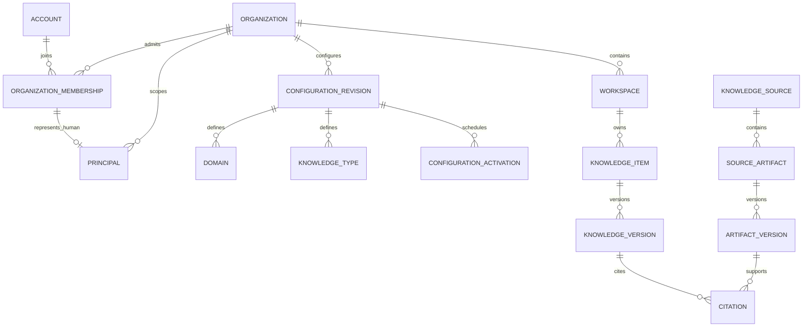

# KC-002 — Multi-tenant physical model

## Storage conventions

IDs are application-generated UUIDv7 values stored as PostgreSQL `uuid`, without database defaults. SQL names use snake_case; `organization_id` represents OrganizationID. Every tenant entity has a tenant-leading key/index and tenant-aware foreign keys. Timestamps use `timestamptz`; business dates use `date`. Core relationships are relational; tenant metadata is JSONB validated against versioned definitions. Foreign keys use `ON DELETE RESTRICT`; there are no cascading tenant deletions.

## Implemented tenant and identity foundation

| Table | Key and important relationships |
|---|---|
| core.organization | organization_id; globally unique organization_key; provisioning/active/suspended/deactivated; language, timezone, configuration, soft deletion |
| core.workspace | workspace_id; organization_id; unique organization/workspace_key; composite organization/workspace_id |
| core.organization_setting | organization_setting_id; unique organization/setting_key; setting_value JSONB |
| identity.account | global account_id; optional unique case-insensitive email; no direct tenant runtime access |
| identity.organization_membership | organization_membership_id; unique organization/account; status, joined_at, left_at |
| identity.principal | principal_id; organization_id; USER/GROUP/SERVICE/AI_AGENT; USER has an account and same-tenant membership; type/identity immutable |
| identity.external_identity | external_identity_id; organization/principal FK; unique organization/provider/provider_tenant_id/provider_object_id |
| identity.group_membership | group_membership_id; same-tenant group and member; effective interval; actual GROUP parent and cycle checks |
| security.session_ticket | SHA-256 token hash; organization/principal; login audience; short expiry; broker-only access |
| security.configuration_permission | configuration_permission_id; organization/principal; can_approve and effective interval; provisioner-managed |
| audit.event | application-generated audit_event_id; actor, action, entity, before/after snapshots, optional request/correlation IDs |

A global human account can have separate principals in multiple organizations. The same external identity can map to these tenant principals without making authorization global. Provider tenant IDs normalize absence to an empty string to avoid NULL uniqueness loopholes. External identity linking requires the trusted authentication broker; email alone is not proof of identity.

Nested groups are supported. The initial cycle rule is deliberately conservative across historical intervals, so an expired reverse membership does not permit a cycle. Membership revocation and inactive accounts/principals invalidate ticket context on subsequent statements.

## Implemented configuration model

Each configuration entity has an entity-specific UUID, organization_id, configuration_revision_id, stable key, display_name, description, is_enabled, and JSONB metadata. Unique keys are scoped to organization/revision. All configuration references include organization **and revision**; historical rows cannot point into a later revision.

| Entities | Configuration |
|---|---|
| domain | parent domain, optional same-tenant workspace, ordering, arbitrary hierarchy depth with cycle rejection |
| taxonomy / taxonomy_term | multiple taxonomies; terms reference parents in the same taxonomy and revision |
| term_alias | language, synonym/acronym/alias/translation kind; many aliases per term |
| knowledge_type | default authority/classification/workflow, approval and AI-use defaults |
| custom_field_definition | text, number, Boolean, date/time, choice, multichoice, currency, URL, email, rich text, person/group, knowledge/source references, calculated fields; validation, conditions, calculation, defaults and search/AI flags |
| custom_field_choice / knowledge_type_field | allowed choices, order, type assignment and requiredness |
| relationship_type / relationship_type_restriction | forward/reverse labels, symmetry, self-reference/evidence flags; optional allowed source/target type pairs |
| authority_level / classification | tenant-defined trust and sensitivity ranks, evidence/approval requirements, AI and external-provider handling |
| lifecycle_workflow / lifecycle_state / lifecycle_transition | per-workflow states; one initial state; same-workflow edges, approval role/count, human requirements and conditions |
| role / responsibility_requirement | business roles, allowed principal kinds, type-specific min/max responsibility counts, human requirement |
| knowledge_template / template_responsibility / template_field | type and governance defaults, domains, content sections, metadata defaults, review rules and required roles/fields |

`governance.configuration_revision` groups a complete snapshot under package_key/version. `configuration_activation` assigns a non-overlapping effective interval per organization/package. Approved revisions and their entities are immutable. Deactivation shortens an activation interval and records an audit event. To deactivate individual vocabulary entries, publish a successor revision with `is_enabled=false`; keep historical revisions intact.

`configuration_proposal` keeps the original package, generator identity/kind, rationale, confidence, evidence references, model/provider metadata, reviewer decision and note. Human edits live in the linked draft revision. Approval records its exact materialized snapshot and digest, preserving what the reviewer actually approved rather than assuming it equals the AI suggestion.

Advanced field definitions and conditional/calculation/transition rules are represented now. Evaluation of knowledge-item values, conditional requirements, reference permissions, calculations, responsibility assignment and lifecycle transitions belongs to the future knowledge service. No embedded expression is executed by this foundation.

## Physical specification for later knowledge/source modules

These tables were designed here, **not created by KC-003/004 migrations**, following the agreed sequence. KC-005 now implements the knowledge item/version, source/artifact/version, citation, responsibility, review and direct-entitlement subset; see [the implemented SOP slice](sop-workflow.md) for its exact fields and limits. The table below remains the broader target specification. Each row assumes organization_id, UUID primary ID and explicit restrictive tenant-aware FKs.

| Planned table | Principal columns and constraints |
|---|---|
| catalog.knowledge_item | knowledge_item_id; owning_workspace_id; knowledge_key unique per organization; primary knowledge_type_id and configuration_revision_id; title, summary; current_version_id; state/authority/classification IDs; AI/search flags; effective/review dates; custom_metadata; created/updated/deleted actor/time |
| catalog.knowledge_version | knowledge_version_id; knowledge_item_id; major/minor unique per item; title/summary/content; metadata; content_hash; status; created/published actor/time; published contents immutable |
| catalog.knowledge_item_domain | association ID; item/domain/versioned configuration FKs; unique item/domain; partial unique index for one primary domain |
| catalog.knowledge_item_workspace | share ID; item/workspace; share_mode reference/read/contribute; expiration and sharing actor; does not bypass security |
| catalog.knowledge_relationship | relationship_id; from/to item IDs; versioned relationship type; origin/confidence; effective interval; status; creator/approver; superseded relationship |
| catalog.relationship_evidence | association ID; relationship/citation FKs; unique pair |
| source.knowledge_source | knowledge_source_id; source type/key; provider-independent connector kind; secret/configuration reference; trust and sync state |
| source.source_artifact | source_artifact_id; source ID; unique source/external ID; URI, title, MIME type, source timestamps, hash, source metadata |
| source.artifact_version | artifact_version_id; artifact ID; provider version key/hash; immutable content reference and capture time |
| catalog.citation | citation_id; knowledge_version/artifact_version FKs; locator type/start/end; evidence/hash/strength; actor/time; supports page, line, section, timestamp, row, cell, message and custom locators |
| governance.knowledge_responsibility | responsibility ID; item/principal/versioned role; effective interval; preserve accountable actor history |
| governance.review | review ID; item/version; reviewer, decision, comments, due/decided times |
| governance.retention_policy | retention_policy_id; versioned hold/retention/purge rules; controlled legal deletion |
| security.access_policy / access_policy_rule | policy and rule IDs; versioned conditions, explicit allow/deny, principal/group/attribute scopes |
| security.knowledge_item_policy / workspace_policy | item/workspace-to-policy associations; tenant-aware restrictive FKs |
| security.source_acl | ACL ID; source/artifact/version scope; external subject mapped to principal; allow/deny; source version, freshness, revocation state |
| operations.query / retrieval_event / answer | query/retrieval/answer IDs; requesting principal; security-scoped telemetry, result/citation references, provider metadata |
| operations.feedback / knowledge_gap | feedback/gap IDs; query/item context, result quality, missing/stale/conflicting knowledge, steward assignment |

Future tenant indexes begin with organization_id, followed by workspace, type, lifecycle, authority, review date or entity identifier according to measured access paths. Add JSONB GIN/expression indexes selectively; do not index every custom field by default. Search/vector data remains rebuildable and separate from the authoritative model. Localization can extend stable keys and aliases without changing tenant identity.
